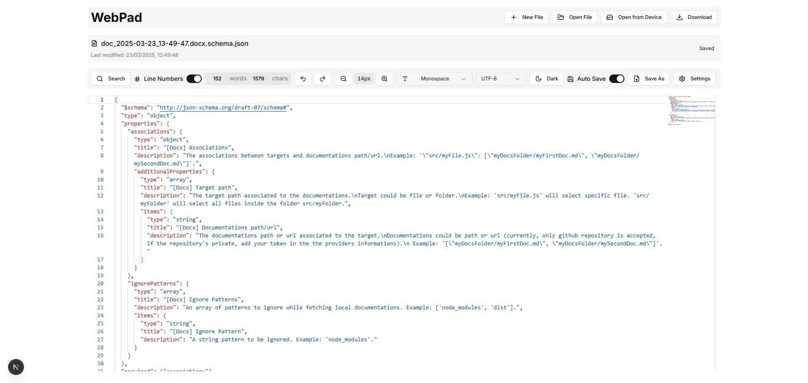
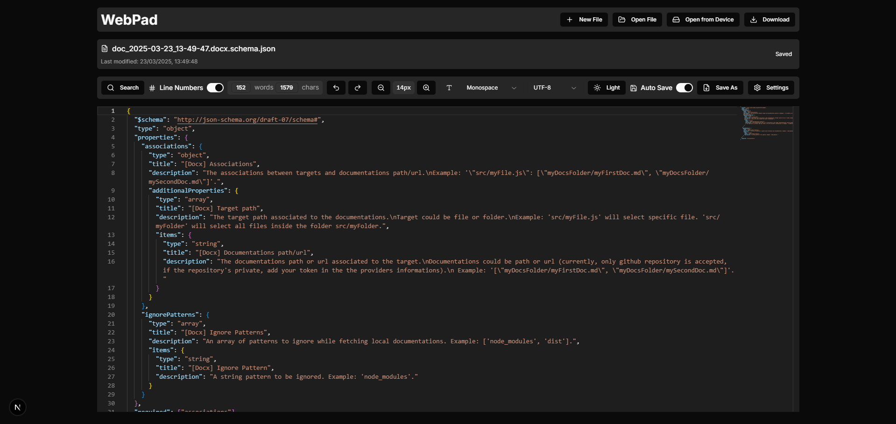

# WebPad - A Modern Web-Based Code Editor
WebPad is a powerful, web-based code editor built with Next.js that provides a seamless coding experience right in your browser. With features like real-time editing, file system access, and customizable settings, WebPad makes it easy to write and edit code from anywhere.


## Features

### Core Features
- **Real-time Code Editing**: Powered by Monaco Editor (VS Code's editor)
- **File System Access**: Direct integration with your local file system
- **Auto-save**: Automatic saving of your work to prevent data loss
- **Multiple Language Support**: Syntax highlighting for numerous programming languages
- **Theme Support**: Light and dark themes for comfortable coding
- **Customizable Interface**: Adjustable font size and font family
- **Word and Character Count**: Real-time tracking of document statistics

### Supported File Types
WebPad supports a wide range of file types including:
- JavaScript/TypeScript (js, jsx, ts, tsx)
- Web Development (html, css, scss, less)
- Markdown and Documentation (md, mdx, txt)
- Programming Languages (python, ruby, java, c/c++, and more)
- Configuration Files (json, yaml, toml)
- Shell Scripts (sh, bash, powershell)

## Getting Started

### Prerequisites
- Node.js (version 18 or higher)
- npm or yarn package manager

### Installation

1. Clone the repository:
```bash
git clone https://github.com/ankurjaiswalofficial/webpad.git
cd webpad
```

2. Install dependencies:
```bash
npm install
# or
yarn install
```

3. Start the development server:
```bash
npm run dev
# or
yarn dev
```

4. Open [http://localhost:3000](http://localhost:3000) in your browser

## Usage Guide

### Opening Files
1. Click the "Open File" button in the toolbar
2. Select a file from your local system
3. The file will open in the editor with appropriate syntax highlighting

### Editor Settings
- **Font Size**: Adjust using the slider in the toolbar
- **Font Family**: Choose from available fonts in the dropdown
- **Theme**: Toggle between light and dark themes
- **Auto-save**: Enable/disable automatic saving

### Keyboard Shortcuts
- `Ctrl/Cmd + S`: Save file
- `Ctrl/Cmd + O`: Open file dialog
- `Ctrl/Cmd + ,`: Open settings

## Development

### Project Structure
```
src/
  ├── app/          # Next.js app directory
  ├── components/   # React components
  ├── hooks/        # Custom React hooks
  ├── lib/          # Utility functions and helpers
  └── types/        # TypeScript type definitions
```

## Project View
- Light Mode

- Dark Mode



### Built With
- [Next.js](https://nextjs.org) - React framework
- [Monaco Editor](https://microsoft.github.io/monaco-editor/) - Code editor
- [Radix UI](https://www.radix-ui.com/) - UI components
- [Tailwind CSS](https://tailwindcss.com) - Styling
- [Framer Motion](https://www.framer.com/motion/) - Animations

## Contributing

Contributions are welcome! Please feel free to submit a Pull Request.

## License

This project is licensed under the MIT License - see the LICENSE file for details.
